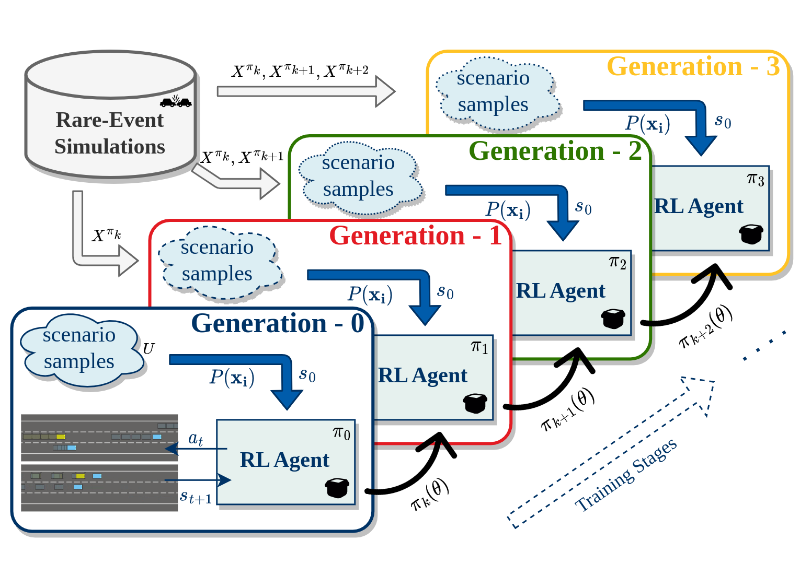

## Experiments

Please follow the [readme instructions](https://github.com/resuldagdanov/self-improving-RL/blob/main/README.md) to construct experiments.

<p align="center">
    <br/>
    <em>An illustration of continuous RL training pipeline for safety-critical black-box systems.</em>
</p>

---
## Conduct Experiments

Detailed instructions on how to conduct experiments can be found in the [readme](https://github.com/resuldagdanov/self-improving-RL/blob/main/README.md). The following is a brief summary of the steps.

---
## Run Black-Box Verification Algorithms

---
* Grid-Search Validation
```sh
cd ./algorithms
python grid_search.py
```

---
* Monte-Carlo-Search Validation
```sh
cd ./algorithms
python monte_carlo_search.py
```

---
* Cross-Entropy-Search Validation
```sh
cd ./algorithms
python ce_search.py
```

---
* Bayesian-Optimization-Search Validation
```sh
cd ./algorithms
python bayesian_search.py
```

---
* Adaptive-Multilevel-Splitting-Search Validation
```sh
cd ./algorithms
python ams_search.py
```

---
## Self-Improvement of Black-Box System

---
* Train RL on Custom Verification Scenarios
```sh
cd ./training
python self_improvement.py
```

---
## Analysis of Results

---
* Open Jupyter Notebook
```sh
cd ./analyses
python3 -m notebook
```